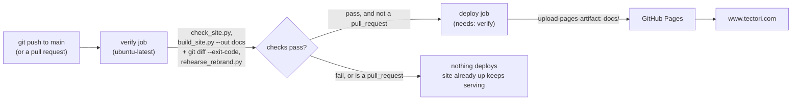
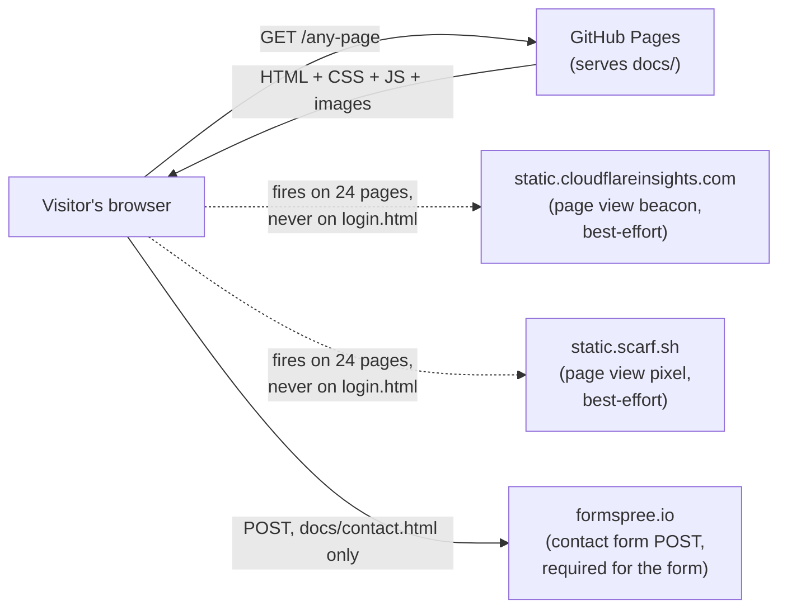

# Architecture

The shape of this repository: what generates the site, what checks it, what
ships it, and where a request crosses a trust boundary. This is not
`THEORY.md`; that file holds what the code does not say. This file holds what
calls what.

## Build and check, on a contributor's machine or in CI

```mermaid
flowchart TB
    subgraph source["Source, committed"]
        siteContent["site/content/*.json\n(site.json, founder.json,\npages.json, public_pages.json)"]
        sitePages["site/pages/*.frag\n(body, jsonld)"]
        siteFragments["site/fragments/*.frag\n(header, footer, utility-bar,\nskip-link, tail, robots)"]
        siteStatic["site/static/\n(styles.css, script, images)"]
        loginSrc["site/pages/login.page.frag"]
    end

    build["scripts/build_site.py"]
    docsOut["docs/\n(published tree, 43 files)"]

    siteContent --> build
    sitePages --> build
    siteFragments --> build
    siteStatic --> build
    loginSrc -->|copied unchanged| build
    build -->|"--out docs"| docsOut

    subgraph checks["scripts/check_site.py runs these in order"]
        buildCheck["build_site.py --check\n(rebuild into temp, byte-diff docs/)"]
        llmsDrift["check_llms_drift.py"]
        verifySite["verify_site.py"]
        sourceOnly["check_source_only_build.py\n(site/+scripts/ only, no docs/ present)"]
        lastmod["check_lastmod.py\n(reads git history)"]
        stdlibOnly["check_stdlib_only.py"]
        docClaims["check_doc_claims.py\n(reads README.md, PERMISSIONS.md)"]
        permHosts["check_permissions_hosts.py\n(reads PERMISSIONS.md, site.json)"]
        noNetwork["check_no_network_calls.py"]
        checksWired["check_checks_wired.py"]
        classNames["check_class_names.py\n(reads docs/, site/static/styles.css)"]
        docCommands["check_documented_commands.py\n(reads every *.md)"]
        deployGate["check_deploy_gate.py\n(reads .github/workflows/verify.yml)"]
        renderCompare["compare_render.py\n(docs/ vs a fresh build)"]
        rehearse["rehearse_rebrand.py\n(--full only, clones tree outside repo)"]
    end

    docsOut --> buildCheck
    docsOut --> llmsDrift
    docsOut --> verifySite
    docsOut --> renderCompare
    docsOut --> classNames

    verifySite -->|"reads"| siteContent
    permHosts -->|"cross-checks"| siteContent
```

`build_site.py` is the only script that writes into `docs/`, and only when
told `--out`. Every check reads the tree; none of them writes it except the
build itself and, for `check_source_only_build.py` and `rehearse_rebrand.py`,
into a throwaway copy outside the repository.

## Deploy, `.github/workflows/verify.yml`

The deploy job runs only `needs: verify` and only `if:
github.event_name != 'pull_request'`, so a pull request runs every check and
ships nothing, and a failed check on `main` leaves the previously deployed
tree serving. `check_deploy_gate.py` reads this file and fails if that wait
or that condition is ever removed.

## Runtime, a visitor's browser

The site itself makes no outbound call at build, check, or deploy time.
Every arrow above except the initial page request is the visitor's browser
acting on published markup: the beacon and the pixel are best-effort and
degrade to nothing if blocked, the phone number on the same page is the
fallback if Formspree is unreachable. `docs/login.html` is excluded from the
beacon, the pixel, and the generator itself; it carries its own
Content-Security-Policy denying connections, framing, and form actions, and
is copied into `docs/` unchanged rather than rendered.

`scripts/check_permissions_hosts.py` requires this same host list to appear,
in both directions, in `PERMISSIONS.md`'s network egress section and in
`site/content/site.json`'s `allowed_external_hosts`. `verify_site.py` fails a
build that references a host outside that list.

## Trust boundaries

- **Source (`site/`) to build output (`docs/`)**: crossed only by
  `build_site.py`. Everything in `docs/` traces back to a committed source
  file or a copied static asset; `check_source_only_build.py` proves the
  source alone is sufficient by building with no pre-existing `docs/` on
  disk at all.
- **Repository to GitHub Actions runner**: crossed on every push and pull
  request. The runner has `contents: read` only for the verify job; the
  deploy job separately holds `pages: write` and `id-token: write`, no
  stored secrets.
- **GitHub Pages to the public internet**: the only network-facing boundary
  this repository controls, populated solely by the `deploy` job's uploaded
  artifact.
- **A visitor's browser to third-party hosts**: `static.cloudflareinsights.com`,
  `static.scarf.sh`, and `formspree.io`, all over HTTPS, none reachable from
  build, check, or deploy code. This is the boundary `PERMISSIONS.md`'s
  operator-accounts section and `site/content/site.json`'s `third_party`
  values exist to keep honest after a rebrand.
- **The operator's machine to GitHub**: `git push` to `main` is the only
  action that starts a deploy; there is no other path to production.

## What this leaves out

Per-page content structure, the header/footer token substitution, and the
rebrand runbook are `README.md` and `site/README.md` territory; this file
does not restate them. Constraints the code does not say out loud, why a
rule exists rather than what calls what, belong in `THEORY.md`.
